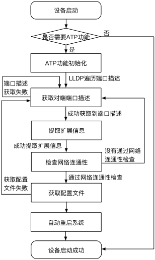

.. note::
 自动部署功能为ConnetOS交换机出厂自启动功能，在ConnetOS交换机上线及工作过程中，不需要再进行额外的配置。

自动部署配置
=======================================

简介
---------------------------------------

概述
+++++++++++++++++++++++++++++++++++++++
自动部署ATP（Auto Provision）功能，是指新出厂或空配置的设备，上电启动时采用的一种自动加载配置文件的功能。

ConnetOS交换机支持两种方式实现设备的自动部署：
 
 * 极简部署方式

   只需要在核心交换机的端口描述上新增扩展信息，通过LLDP协议传递如下信息，就能实现零配置和自动化：

    * 管理网口IP地址
    * TFTP服务器IP的第4个字节

    例如，端口描述“TO-XXXXXXX@192.168.1.10@100”或“TO-XXXXXXX@192.168.1.10@192.168.1.100”表示，TOR管理IP地址为192.168.1.10，TFTP服务器IP地址为192.168.1.100，配置文件的名字为192.168.1.10_yunqi.cfg。

 * ZTP（Zero Touch Provisioning）方式

   该方式需要部署DHCP服务器，并在DHCP服务器上配置必要的参数。

    * 管理网口IP地址
    * TFTP服务器IP地址

基于LLDP的极简部署方式是云启开放专利的最简单高效的零配置自动部署方案，推荐使用这种方式来部署，与传统的基于DHCP的ZTP相比，具有如下优点：

    * 真正意义上的全自动、零人工参与。
    * 网络规划视角驱动，无额外运维负担增加。
    * 无缝整机替换，即插即用。
    * 强大的容错能力。

两种部署方式的上线流程比较如下表所示。

=========================   ================================   ==============================
\                           极简部署流程                       ZTP部署流程
=========================   ================================   ==============================
上线设备IP地址              通过LLDP自动配置IP地址              通过DHCP获取IP地址
维护设备MAC和配置关系       不需要维护，只需准备配置文件即可    需要手动维护
DHCP服务器                  不需要专门维护，无需扩展            需要扩展option来传递配置信息
配置过程记录                完整纪录配置细节，可远程跟踪异常    不记录
=========================   ================================   ==============================

ATP工作原理
+++++++++++++++++++++++++++++++++++++++
ATP的两种工作模式是同时运行的，根据设备外界的配置环境自动选取工作模式。这里主要介绍基于LLDP的极简部署方案的工作原理，其流程如下所示：

ATP自动部署流程

极简部署的实现流程为：

 #. 设备上电启动
    
    设备上电启动后，如果设备有配置文件，则以该配置文件正常启动；如果是空配置设备，则进入ATP流程。

 #. ATP功能进行初始化，通过LLDP遍历对端端口，获取端口描述。
    
    如果不能成功获取，60s之后，会重新获取。

 #. 成功获取到端口描述后，会对端口描述进行合法性检查。
    
    * 如果检查通过，将提取扩展信息。
    * 检查检查不通过，将重新获取端口描述，重新执行步骤2。

 #. 提取扩展信息后，进行网络连通性检查。
   
    * 如果检查通过，将获取配置文件。
    * 如果检查不通过，将重新获取端口描述，重新执行步骤2。

 #. 获取配置文件后，将自动重启系统。
    
    如果获取配置文件失败，将将重新获取端口描述，重新执行步骤2。

 #. 设备重新启动，ATP完成，设备正常工作。

ATP操作指导
---------------------------------------

首次上线
+++++++++++++++++++++++++++++++++++++++
在部署ATP之前，首先确定选取哪种部署方式，然后根据不同的部署方式进行如下准备：
 
 * 采用LLDP的极简部署方式

   * 在TOR上联的核心交换机中，选择一台配置aaa@x.x.x.x@y或aaa@x.x.x.x@y.y.y.y扩展信息并开启LLDP功能；
   * 在TFTP服务器上，按照x.x.x.x_yunqi.cfg的形式放置配置文件。

 * 采用DHCP的ZTP部署方式

   * 在DHCP服务器上静态配置设备MAC与IP地址的分配关系；
   * 扩展DHCP option支持获取TFTP服务器的IP地址。比如在dhcpd.conf中定义"option tftp-server-address code 150 = ip-address;"，" option tftp-server-address x.x.x.x;"
   * 在TFTP服务器上，按照x.x.x.x_yunqi.cfg放置配置文件。

完成上述准备后，将TOR的上联光纤插好再加电，ATP就会立即开始工作。整体流程为：

 #. 自动配置设备IP地址
 #. 自动获取初始配置
 #. 自动加载配置
 #. 重启，设备自动部署成功。

整机替换
+++++++++++++++++++++++++++++++++++++++
交换机进行整机替换时:

 * 采用LLDP的极简部署方式

   * 如果是使用同型号机型替换，则不需要更改上述准备，只需要将新的TOR放到架上，插上光纤加电即可.
   * 如果是不同机型，则可能需要更改TFTP server中的配置文件以适配新的型号，然后插上光纤加电即可自动部署。

 * 采用DHCP的ZTP部署方式
 
   * 如果是使用同型号机型替换，需要 **更改DHCP服务器上新设备MAC与IP地址的分配关系** ，然后将新的TOR放到架上，插上光纤加电即可；
   * 如果是不同机型，则还可能需要更改TFTP server中的配置文件以适配新的型号，然后插上光纤加电即可自动部署。

完成上述操作后，TOR会自动获取到最新的配置文件并完成加载。整体流程为：

   #. 自动配置设备IP地址
   #. 自动获取历史最新配置
   #. 自动加载配置
   #. 重启，设备自动部署成功。

查看部署状态
---------------------------------------
在运维模式下执行 **show atp** 命令，查看当前自动部署的状态以及如果没有部署成功时的出错信息::

 ConnetOS> show atp
 State: TFTP_FIN
 The configure file is invalid

根据ATP的状态，对照下表中的状态以及提示信息帮助定位部署失败的原因。

====================   =============================================================================================== 
状态                    描述                                                                                           
====================   ===============================================================================================
ADDRESS_COLLECTING     正在搜集管理口IP和TFTP服务器IP。如果地址获取失败：                           
                          
                        * LLDP方式要检查上联口的端口描述符，配置的格式是否为：

                          * XXXXX@192.168.1.10@100
                          * XXXXX@192.168.1.10@192.168.1.100
                          
                        * DHCP的方式则检查：

                          * DHCP服务器是否正确分配IP给管理口。
                          * 定义option150对应的TFTP服务器地址是否正确。

ADDRESS_VALID          管理口IP和TFTP服务器IP地址校验合法。
                       
                       如果管理口和TFTP服务器网络不通，检查网络的连通性。
NETWORK_VALID          管理口和TFTP服务器网络连通。下载文件失败，可能是：
                         
                        * TFTP服务器地址错误
                        * TFTP服务器不存在或存在错误的配置文件名。
                            
                       文件名要以管理口IP地址加厂商命名，如“192.168.1.33_yunqi.cfg”。

TFTP_FIN               完成配置文件的下载。配置文件不合法，有两个原因：

                        * 下载了空的配置文件
                        * 配置文件中管理口IP不等于当前设备已配置的管理口IP。

SUCCESS                自动部署成功。
                          
                       配置文件校验成功并重命名为启机配置文件。重启之后，部署完成。
====================   ===============================================================================================

