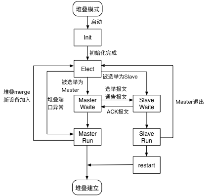

简介
=======================================

概述
---------------------------------------
随着数据中心数据访问量的逐渐增大，对交换机提出了高密度端口、高可靠性、高性能的要求，而单台交换机由于存在单点异常、端口数量等问题已经无法满足数据中心的需求，交换机虚拟化技术（如堆叠）应运而生。

ConnetOS支持的ISS（Intelligent Stacking System）堆叠功能，是指将两台及以上的交换机组合在一起，从逻辑上组成一台交换机。用户通过对这台“逻辑交换机”的管理，实现对堆叠中所有交换机的管理。

通过堆叠，可以实现网络高可靠性和网络大数据量转发，同时简化网络管理。ISS堆叠主要有以下优点：

 * 简化运维。整个堆叠系统被作为一台交换机进行管理，配置命令直接在堆叠内的所有交换机上生效；用户可以通过登录堆叠内的任意一台交换机，对堆叠内的所有交换机进行统一配置和管理。
 * 高可靠性。堆叠内的交换机互为备份，同时，利用跨设备的Eth-Trunk实现跨设备的链路冗余备份。
 * 强大的网络扩展能力。通过组建堆叠，在不改变网络拓扑的情况下，扩展端口数量、带宽和处理能力。

常见概念
---------------------------------------
* 角色
  ISS堆叠中的单台设备称为成员设备。成员设备按照功能不同，分为两种角色：
  
  * Master：负责整个堆叠的运行、维护和管理，由角色选举产生。一个堆叠中同一时刻只能有一台Master设备
  * Slave：隶属于Master设备，作为Master设备的备份设备运行。堆叠中除了Master设备，其它设备都是Slave设备。

* Member ID：成员设备ID，用来标识和管理成员设备。堆叠中交换机的堆叠成员ID都是唯一的。
* ISS分裂：ISS系统形成后，由于ISS链路故障，导致ISS中两相邻成员设备上不连通，一个ISS变成两个ISS的过程称为ISS分裂（split）。
* ISS合并：两个各自已经稳定运行的I SS系统，通过物理连接和必要的配置，形成一个ISS的过程，称为ISS合并（merge）。
* ISS链路：成员设备之间用于互连形成ISS的链路。
* MAD：Multi-Active Detection，多Active检测，当ISS分裂后会产生多个ISS Master，MAD就是用来检测ISS分裂的机制。
* 堆叠接口：被配置为堆叠模式的物理接口，用于堆叠成员交换机之间的连接。

ConnetOS支持的堆叠特性
=======================================
在为了防止堆叠建立后，大量的报文跨越中间有限带宽的堆叠链路进行转发导致链路满载现象出现，ISS采取报文转发本地优先机制。对于等价路由或聚合端口，如果本地有出口时，报文直接由本地转发，不会经过堆叠链路，只有当本地出口down时，才经堆叠链路由另一台设备进行转发。

在ISS堆叠开始运行后：

 * 在maste设备上的配置，在堆叠系统内的所有交换机上同时生效。
 * 远程登录界面都能进行配置，但是对管理网络接入有要求：单线接入时必须接入到Master。
 * 串口界面只有Master能做配置，Slave只能做查询。
 * 切换ISS模式后，以下特性暂时不能使用：LLDP、SNMP、ATP。

ISS堆叠的工作原理
---------------------------------------
ISS堆叠系统中的成员设备通过私有协议报文（如Hello报文）传递本设备的信息到相邻设备，选举出ISS系统中各个设备的角色（Master或者Slave），建立ISS拓扑数据库，并管理整个拓扑关系，当拓扑发生变化的时候，通知相应的业务模块。

ISS的主要报文有：

 * Hello报文：点对点报文，在相邻设备间交互，携带本设备所收集到的所有的设备信息、优先级信息和其它上下文信息。
 * Elect选举报文：点对点报文，设备仅仅携带用于选举的相关信息，如设备MAC，优先级，系统运行时间等。注意这里包括参加选举的所有设备的信息。
 * Anno通告报文：竞选结果通告报文，Master发送宣布竞选结果，Slave回复ACK进行确认。
 * Urgent报文：广播报文，用于ISS系统紧急事件的通告，如堆叠口DOWN。
 * Load加载报文：自动升级时的加载报文，专门用于版本下载。（不支持Auto update）

整个ISS堆叠的生命周期分为：物理连接、拓扑收集、角色选举、堆叠管理、堆叠维护五个阶段。如下图所示。

ISS堆叠生命周期

.. image:: iss_circle.png

建立物理连接
+++++++++++++++++++++++++++++++++++++++
建立堆叠系统，在对设备进行物理连接前，首先对两台单独的交换机进行设置：
 
 * 设置成员设备ID，用于成员选举。
 * 设置堆叠接口，用于物理连接。

然后用线缆连接两台堆叠设备。

拓扑收集
+++++++++++++++++++++++++++++++++++++++
设备连接好后，堆叠中的成员设备通过和相邻的成员设备交互hello报文收集整个堆叠的拓扑关系。Hello报文会携带拓扑信息，包括：堆叠口连接关系、成员设备编号、成员设备优先级、成员设备的桥MAC等内容。

成员设备在本地记录自己已知的拓扑信息。在设置为堆叠模式之初，每个成员设备都只记录了自身的拓扑信息；当堆叠口变为Up之后，成员设备通过Up的堆叠口将拓扑信息发送出去，同时在收到邻居的拓扑信息之后，更新本地的拓扑信息；当所有成员设备上都收集到完整的拓扑信息后，进行角色选举。

角色选举
+++++++++++++++++++++++++++++++++++++++
堆叠建立时，成员设备之间互相发送竞争报文，选举Master设备。只有完成角色选举，选出Master设备后，堆叠系统才能正常运行。

在堆叠拓扑动荡时，ISS系统进行角色选举，比如：
 
 * 堆叠建立：新建立堆叠系统
 * 新设备加入
 * ISS分裂
 * ISS合并

角色选举规则
+++++++++++++++++++++++++++++++++++++++
角色选举时，由第一条规则开始顺序判断，直到找到唯一的最优成员才停止选举。此最优成员为Master设备，其他设备为Slave设备。

角色选举的具体规则如下：

 #. 当前Master优先。堆叠系统刚形成时，没有Master设备，所有加入的设备都认为自己是Master，会跳转到第二条规则继续比较
 #. 成员优先级大的优先
 #. 系统运行时间长的优先
 #. 成员桥MAC地址小的优先

角色选举过程
+++++++++++++++++++++++++++++++++++++++
角色选举时，有如下的协议状态：

 * Init（初始化）：设备启动后，ISS完成内部数据初始化的状态。
 * Elect（选举）：设备进行Master/Slave身份的选举。
 * MasterWait（Master等待）：选举结束后，有可能成为Master的设备进入MasterWait状态，并发送选举结果通告。
 * SlaveWait（Slave等待）：选举结束后，未来有可能成为Slave的设备进入SlaveWait状态，等待Master的最终确认通告。
 * MasterRun（Master运行）：发送选举通告后，在堆叠系统的最终身份确定为Master，并以Master的身份运行。
 * MasterRun（Master运行）：收到Master的选举通告后，在堆叠系统的最终身份确定为Slave，并以Slave的身份运行。

角色选举的具体过程如下：

 #. 将设备设置为堆叠模式后，ISS模块启动，为Init状态。
 #. 初始化完成后，变为Elect状态，等待选举。
 #. 如果选举过程中，找不到其他的堆叠设备进行选举，如找不到up堆叠口、发送到其他堆叠口的hello报文超时、堆叠的设备类型不同，本设备将直接作为Master运行。
 #. 选举时间到，选举完成
    
    * 被选为Master的设备，进入MasterWait状态，发送选举报文和通告报文。Master收到Slave接受选举结果的ACK报文后，由MasterWait状态变为MasterRun状态。
    * 被选举为Slave的设备，进入SlaveWait状态，等待Master发送选举报文和通告报文。收到报文后，回复ACK报文接受选举结果，由SlaveWait状态变为SlaveRun状态。

 #. Slave设备重启，加入堆叠。堆叠建立成功。
 #.   堆叠建立成功后，如果Master退出，或者有新设备加入，重新进行Master和Slave的选举。

堆叠建立过程示意图

设备最终的运行状态只能是MasterRun或者SlaveRun，其它状态均是临时状态。

堆叠运行
+++++++++++++++++++++++++++++++++++++++
堆叠运行的过程中，进行业务的转发、实时同步数据和配置。

堆叠维护
+++++++++++++++++++++++++++++++++++++++

拓扑维护
^^^^^^^^^^^^^^^^^^^^^^^^^^^^^^^^^^^^^^^
堆叠中直接相邻的成员设备之间会定期交换Hello报文。如果持续一定周期未收到直接邻居的Hello报文，则认为该成员设备的Hello报文超时，堆叠会将超时设备从拓扑中隔离出来，并更新拓扑数据库。

当堆叠口Down时，拥有该堆叠口的成员设备会立即广播通知堆叠中其它设备。如果Master设备Down，则触发新的选举。

成员加入
^^^^^^^^^^^^^^^^^^^^^^^^^^^^^^^^^^^^^^^
当一台设备已经启动成功并以Master的身份运行，此时堆叠口UP，有新的设备加入，新设备无论其优先级有多高，都会以Slave的身份加入堆叠系统。

堆叠口UP后，两台设备首先通过Hello报文交互设备信息，此时Master立刻向Slave周期性的广播Elect竞选报文和Anno通告报文，直到Slave设备回复Elect ACK报文，通知拓扑变化事件。

成员退出
^^^^^^^^^^^^^^^^^^^^^^^^^^^^^^^^^^^^^^^
ISS成员退出的原因有两个：

 * 堆叠口DOWN
 * Hello报文超时

根据ISS成员身份的不同，处理过程不同：
 
 * Slave退出
   Master设备由MasterRun切换至Elect选举状态，而逻辑堆叠口DOWN掉后（或者Hello报文超时），就不存在UP的堆叠口了，因此直接切换至MasterRun状态。
 * Master退出
   Slave设备由SlaveRun切换至Elect选举状态，由于不存在UP的堆叠口了，进而切换至MasterWait状态并最终进入MasterRun状态。

堆叠解除
+++++++++++++++++++++++++++++++++++++++
当不需要设备堆叠时，可以进行堆叠的解除。

配置堆叠功能
=======================================

#. 进入配置模式。

   ConnetOS> **configure**

#. 配置堆叠设备的成员ID。

   ConnetOS# **set member-id** *member-id*

#. 配置堆叠设备的成员优先级。

   ConnetOS# **set member-id** *member-id* **priority** *priority-number*

#. 配置堆叠接口。

   ConnetOS# **set interface gigabit-ethernet** *interface-name* **iss-port enable** { **false** | **true** }

#. 使能ISS MAD的检测功能。

   ConnetOS# **set member-id** *member-id* **mad enable** { **false** | **true** }

#. 配置用于ISS MAD的检测的接口。

   ConnetOS# **set member-id** *member-id* **mad interface** *interface-name*
 
#. 配置用于ISS MAD的检测的接口。
  
   ConnetOS# **set member-id** *member-id* **mad excluded-interface** *interface-name*

#. 提交配置。

   ConnetOS# **commit**

配置完成后，重启设备。

   