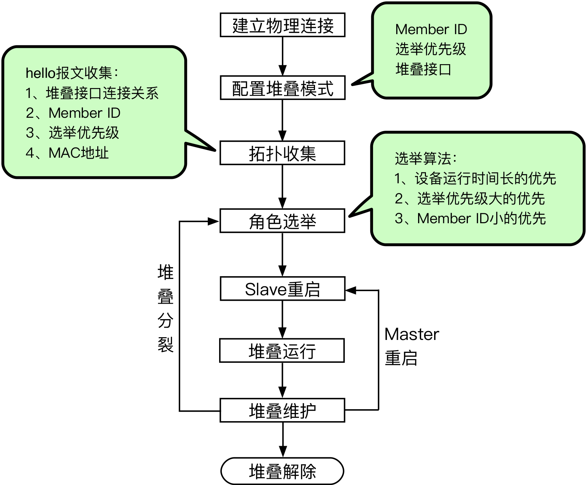

ISS堆叠的工作原理
=======================================

ISS堆叠系统中的成员设备通过Hello报文传递本设备的信息到相邻设备，选举出ISS堆叠系统中各个设备的角色（Master或者Slave），建立ISS堆叠拓扑数据库，并管理整个拓扑关系.

整个ISS堆叠的生命周期分为如下几个阶段：

堆叠的建立过程
---------------------------------------
堆叠建立的主要过程为：

#. 保证用于堆叠的设备，正常通信。
#. 将设备配置为堆叠模式，配置Member ID、选举优先级、堆叠接口。
#. 堆叠成员设备通过Hello报文交换信息，收集拓扑关系。

   Hello报文会携带：堆叠接口连接关系、Member ID、选举优先级、设备的MAC。

   成员设备在收到邻居的拓扑信息之后，更新本地的拓扑信息。

#. 当所有成员设备上都收集到完整的拓扑信息后，进行角色选举。

   角色选举时，从第一条规则开始判断。满足第一条规则，Master直接会被选出。否则会继续下一条规则的比较。

   #. 系统运行时间长的优先。
   #. 选举优先级高的优先。
   #. Member ID小的优先。
   
   只有完成角色选举，选出Master设备后，堆叠系统才能正常运行。

#. 完成Master和Slave的选举后，Slave进行重启。重启后自动同步Master的配置信息。

#. 完成重启后，堆叠系统正式开始运行。
  
   堆叠运行的过程中，进行业务的转发、实时同步数据和配置。

堆叠维护
---------------------------------------
堆叠运行过程中，成员设备之间会定期交换Hello报文。如果持续一定周期未收到直接邻居的Hello报文，则认为该成员设备的Hello报文超时，堆叠会将超时设备从拓扑中隔离出来，并更新拓扑数据库。

 如果Master重启，Slave会直接变为Master。

 如果成员设备之间的链路断开等问题导致堆叠分裂，会重新进行成员角色的选举。

堆叠检测
+++++++++++++++++++++++++++++++++++++++
堆叠分裂是指，堆叠系统形成后，由于ISS链路故障，导致ISS中两相邻成员设备上不连通，一个ISS变成两个ISS的过程称为ISS分裂（split）。

MAD（Multi-Active Detection，多Active检测），当ISS分裂后会产生多个ISS Master，MAD是用来检测ISS分裂的机制。

