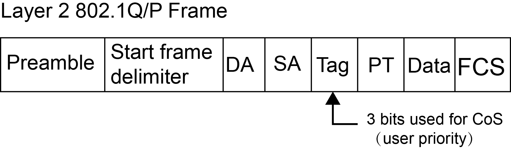

QoS配置
=======================================

简介
---------------------------------------

QoS概述
+++++++++++++++++++++++++++++++++++++++

随着网络技术的发展，互联网中的业务种类越来越多。传统的E-mail、WWW、文件传输等业务，新兴的多媒体游戏、电话会议、在线视频、网络直播等业务，对网络带宽、时延、丢包率等的要求各不相同。同时随着网络的普及，流量激增，更容易产生网络拥塞、增大转发时延，甚至会产生丢包，导致业务质量下降甚至不可用。如何针对不同的业务提供不同层次的服务，同时解决网络拥塞提供更完善的服务迫在眉睫。

QoS技术就是在这种背景下发展起来的。QoS是Quality of Service（服务质量）的简称，根据用户的要求分配和调度资源，对不同的数据流提供不同的服务质量：对实时性强且重要的数据报优先处理；对于实时性不强的普通数据报文，提供较低的处理优先级，网络拥塞时甚至丢弃。

QoS的应用可以通过保证传输的带宽，降低转发时延、丢包率和时延抖动等措施，来提高网络服务质量。

QoS服务模型
+++++++++++++++++++++++++++++++++++++++
网络应用是端到端的通信，两个主机进行通信，中间可能要跨越多个物理网络，经过多台设备，要实现端到端的QoS，就必须从全局考虑。QoS服务模型就是研究采用什么模式实现全局的服务质量保证。

目前QoS有三种服务模型：

 * Best-Effort Service：尽力而为服务模型

 * Integrated Service：综合服务模型，简称Int-Serv

 * Differentiated Service：差分服务模型，简称Diff-Serv

Best-Effort服务模型
^^^^^^^^^^^^^^^^^^^^^^^^^^^^^^^^^^^^^^^
Best-Effort是最简单的QoS服务模型。应用程序可以在任何时候，发出任意数量的报文，而不需要通知网络。而网络则尽最大的可能来发送报文，但对时延、可靠性等性能不提供任何保证。 

Best-Effort服务模型
^^^^^^^^^^^^^^^^^^^^^^^^^^^^^^^^^^^^^^^
Int-Serv模型是指应用程序在发送报文前，首先通过信令向网络描述流量参数，申请带宽。在确定网络已经为其预留资源后，再发送报文。Int-Serv模型下，可以保证报文的丢包率、延迟等要求。

Diff-Serv服务模型
^^^^^^^^^^^^^^^^^^^^^^^^^^^^^^^^^^^^^^^
Diff-Serv是一种基于报文流的QoS模型。在Diff-Serv模型中，应用程序发出报文前，通过设置报文的QoS参数信息，来告知网络节点它的QoS需求。网络根据每个报文流指定的QoS参数信息来提供差分服务，即对报文的服务等级划分，有差别地进行流量控制和转发，提供端到端的QoS保证。

目前，应用最广泛的是Diff-Serv模型。ConnetOS的QoS功能就是基于Diff-Serv模型实现的。

基于Diff-Serv模型的QoS实现
+++++++++++++++++++++++++++++++++++++++
在Diff-Serv模型中，进入网络中的流量被分成不同的类，同一类的流量在网络中被聚合起来统一管理发送，保证相同的QoS服务指标。不同的类享受不同的处理，尤其是当网络出现拥塞时不同的类会享受不同的优先处理，从而得到不同的丢弃率、时延以及时延抖动。

在Diff-Serv模型中，常用到的技术包括：

 * 流分类和流标记（Classification and Marking） 

   将数据包分为不同的类别，并设置为不同的优先级。

   * 流分类：采用一定的规则识别符合某类特征的报文，将数据包分为不同的类别（并不修改原来的数据包优先级信息）。

   * 流标记：将数据包设置为不同的优先级（会修改原来的数据包优先级信息），通过优先级映射和重标记优先级实现。

 * 流量监管和流量整形（Policing and Shaping）和接口限速

   将业务流量限制在特定的带宽。当业务流量超过额定带宽时，超过的流量将被丢弃或缓存。

   * 将超过的流量丢弃的技术称为流量监管。

   * 将超过的流量缓存的技术称为流量整形（流量整形效果需视其缓存的大小而定）。

 * 拥塞管理（Congestion management）
  
   在网络发生拥塞时，使用合适的队列调度机制，优先保证某种报文的QoS服务指标。

 * 拥塞避免（Congestion avoidance）

   监督网络资源的使用情况，当发现拥塞有加剧的趋势时采取主动丢弃报文的策略，通过调整流量来解除网络的过载。通常作用在接口出方向。

流分类和流标记是实现差分服务的前提和基础；流量监管、流量整形、拥塞管理和拥塞避免从不同方面对网络流量及其分配的资源实施控制，是提供差分服务的具体体现。

QoS技术在网络中的应用位置。

.. image:: qos_config.jpg

ConnetOS支持的QoS功能
---------------------------------------

QoS在ConnetOS中的实现流程
+++++++++++++++++++++++++++++++++++++++
ConnetOS在入接口完成流量分类和标记工作，在出接口进行队列调度来分配资源和和控制流量。

具体实现过程如下：

 #. （可选）在入接口对报文进行速度限制，保证网络流量在一个合理的范围内。
 #. 在入接口将报文携带的优先级或者接口优先级映射为内部优先级，按照优先级映射表确定报文进入哪个转发队列。
 #. 根据队列调度算法发送各个转发队列中的报文。
 #. （可选）根据网络流量情况，对出接口的报文进行限速。

QoS处理流程

.. image:: qos_process.jpg

缺省情况下，ConnetOS上的QoS功能是关闭的，即不区分优先级，设备对所有的报文等同处理。

接口限速
+++++++++++++++++++++++++++++++++++++++
接口限速，对通过接口的全部报文流量速率进行限制，以保证带宽不超过规定大小。入方向与出方向的接口限速属于并列关系，用户可以根据需要同时配置，也可以单独配置。

如果不限制用户发送的流量，大量用户不断突发的数据会使网络更拥挤。通过配置入方向的接口限速，可以将通过某个接口进入网络的流量限制在一个合理的范围内。

若需要对接口出方向所有流量进行控制时，可以配置出方向的接口限速。

优先级映射
+++++++++++++++++++++++++++++++++++++++
优先级用于标识报文传输时的优先程度，可以分为：

 * 报文携带优先级：根据公有标准和协议生成，是报文自身的优先等级。
 * 设备调度优先级：又称为本地/内部优先级，是设备内部区分报文服务等级的优先级。

报文进入设备后，设备会根据相应规则选择报文的内部优先级，为队列调度和拥塞控制服务。

优先级映射用来实现报文携带优先级与内部优先级之间的转换。对于进入设备的报文，设备将报文携带的优先级或者接口优先级映射为内部优先级，然后根据内部优先级与队列之间的映射关系确定报文进入的队列，并可以根据配置修改报文发送时所携带的优先级，以便其他设备根据报文的优先级提供相应的QoS服务。

用户可以在不同的网络中使用不同的优先级字段，例如：VLAN网络中使用802.1p，IP网络中使用DSCP等。当报文经过不同网络时，为了保持报文的优先级，需要在连接不同网络的设备上配置优先级字段的映射关系。当设备接收报文时，优先级字段（如802.1p、DSCP）被映射为内部优先级；设备发出报文时，将内部优先级映射为某种外部优先级字段。
设备提供了优先级映射表，分别对应相应的优先级映射关系。

通常情况下，可以通过查找缺省优先级映射表来为报文分配相应的优先级。如果缺省优先级映射表无法满足用户需求，可以根据实际情况对映射表进行修改。

 ====================  ======================  =================
 入口报文携带dscp        入口报文携带8021.p        出口队列
 ====================  ======================  =================
 0～7                   0                       0
 8～15                  1                       1
 16～23                 2                       2
 24～31                 3                       3
 32～39                 4                       4
 40～47                 5                       5
 48～55                 6                       6
 58～63                 7                       7
 ====================  ======================  =================

流分类
+++++++++++++++++++++++++++++++++++++++
流分类就是根据报文的优先级字段（如802.1p、DSCP），对报文进行分类，以识别出具有不同优先级或服务等级特征的流量，实现外部优先级和内部优先级之间的映射。

流分类过程实际上就是信任接口的上行报文携带的优先级标记，并进行优先级映射（即根据优先级映射表，将上行报文携带的QoS优先级统一映射到设备内部的服务等级。

**CoS**：Class of Service 服务级别，L2 802.1Q帧携带的分类信息，在帧头的Tag字段中占3bits，称为用户优先级，范围为0～7。

CoS优先级

**ToS**：Type of Service 服务类型，L3 IPv4包头携带的一个字节的字段，标记IP包的服务类型， ToS字段内可以是IP Precedence值，也可以是DSCP值。

ToS优先级

**IP Precedence**： IP 优先级， L3 IP包头携带的分类信息，共占3bits，范围为0～7。

**DSCP**： Differentiated Services Code Point 差别化业务编码点， L3 IP包头携带的分类信息，共占6bits，范围为0～63，向下兼容IP Precedence。

流标记
+++++++++++++++++++++++++++++++++++++++
为保证被分类报文对应的DSCP值能够传递给网络上的下一跳设备，需要通过流标记动作为报文写入QoS信息，或使用Trust方式直接保留报文中QoS信息。

缺省情况下，流标记总是将对应的DSCP值转化成QoS信息，然后写入到报文CoS字段（对于非IP 报文）、DSCP字段或者IP-precedence 字段（对于IP 报文）中。

接口信任模式
^^^^^^^^^^^^^^^^^^^^^^^^^^^^^^^^^^^^^^^
下游设备可以选择使用上游设备的分类结果，也可以按照自己的分类标准对报文重新进行分类。如果选择使用上游设备的分类结果，则表示该设备信任上游设备的分类结果， 即信任（trust）从连接上游设备的接口接收的报文所携带的QoS标记。因此，设备在实现QoS优先级映射时，可以选择信任接口的上行报文携带的优先级标记（如DSCP、IP Precedence、802.1p），这种模式就称为接口信任模式。

入接口上，既可以设置流分类，也可以配置为信任接口。

配置成信任接口，信任报文cos中携带的标记，根据code-point map映射到出口队列。

目前，ConnetOS支持的如下的信任模式：

 * dscp：IP报文按照报文dscp以及配置的code-point映射到出口队列。非IP报文按照“trust  ieee-802.1”方式处理。
 
 * ieee-802.1：tagged 根据报文的cos以及配置的code-point map映射到出口队列。untagged 根据接口默认cos以及配置的code-point map映射到出口队列。
 
 * inet-precedence：IP报文按照报文ip-pre以及配置的code-point映射到出口队列。非IP报文按照“trust  ieee-802.1”方式处理。

 * trust port：任何报文都按照接口默认cos以及配置的code-point map映射到出口队列。

队列
+++++++++++++++++++++++++++++++++++++++
Queueing即队列，负责将流量送往接口的某个转发队列中，送往接口的不同转发队列的报文将获得不同等级的服务。ConnetOS上，每个接口出方向支持8个队列，以队列索引号进行标识，分别为：0、1、2、3、4、5、6、7。编号越大，优先级越高。

ConnetOS根据本地优先级和队列之间的映射关系，自动将分类后的报文流送入各个队列，然后根据配置的队列调度算法进行调度。通过绑定流分类和转发队列，来确定不同的流量被送往不同的转发队列。

队列指的是在缓存中对报文进行排序的逻辑。当流量的速率超过接口带宽或超过为该流量设置的带宽时，报文就以队列的形式暂存在缓存中。报文离开队列的时间、顺序，以及各个队列之间报文离开的相互关系则由队列调度算法决定。

队列调度技术
+++++++++++++++++++++++++++++++++++++++
拥塞管理是通过调整报文的转发次序，来满足时延敏感业务高QoS服务的一种流量控制机制。对于拥塞管理，一般采用队列技术来处理。

ConnetOS支持以下的队列调度算法：

 * SP（Strict Priority）：严格优先级调度
 * WDRR（Weighted Deficit Round Robin）：带赤字的加权轮询调度
 * SP+WDRR

SP
^^^^^^^^^^^^^^^^^^^^^^^^^^^^^^^^^^^^^^^
SP调度就是严格按照队列优先级的高低顺序进行调度。只有高优先级队列中的报文全部调度完毕后，低优先级队列才有调度机会。在SP调度中，加权值为0。

在报文出队列的时候，首先让高优先队列中的报文出队并发送，直到高优先队列中的报文发送完；然后发送低优先队列中的报文。在调度低优先级队列时，如果高优先级队列又有报文到来，则会优先调度高优先级队列。

SP调度的缺点是：拥塞发生时，如果高优先级队列中长时间有报文存在，那么低优先级队列中的报文就会一直得不到调度机会。

WDRR
^^^^^^^^^^^^^^^^^^^^^^^^^^^^^^^^^^^^^^^
WDRR是以报文字节数为权重的调度算法，可以避免队列的平均报文长度变化时，用户无法通过WRR获取想要带宽的问题。当为某一个队列分配的权重值低于0时，该队列的权重就变为赤字，同时也影响下一次调度对队列赋予的权重。即该队列的新的权重会减去前一次产生的赤字，这样可以避免由于报文长度不等而产生的非预期的调度。

WDRR为每个队列设置一个计数器Deficit，Deficit初始化为一次调度允许的最大字节数，一般为Weight*MTU。每次轮询到一个队列时，该队列输出一个报文且计数器Deficit减去报文长度，如果报文长度超过了队列的调度能力，WDRR调度允许Deficit出现负值，以保证长报文也能够得到调度，但下次轮循调度时该队列将不会被调度。上一轮调度后的Deficit值作为下一轮调度的Deficit。直到计数器为0或负数时停止调度该队列，但继续调度其他计数器不为0的队列。当所有队列的计数器都为0或负数时，所有计数器的Deficit都加上Weight*MTU，开始新一轮调度。

WDRR调度避免了采用SP调度时低优先级队列中的报文可能长时间得不到服务的缺点，也避免了各队列报文长度不等或变化较大时，WRR调度不能按配置比例分配带宽资源的缺点。 

但是，WDRR调度也具有低延时需求业务（如语音）得不到及时调度的缺点。 

SP+WDRR
^^^^^^^^^^^^^^^^^^^^^^^^^^^^^^^^^^^^^^^
SP调度、WDRR调度各有优缺点。单纯采用SP调度时，低优先级队列中的报文长期得不到带宽，而单纯采用WDRR调度时低延时需求业务得不到优先调度。

SP+WDRR调度是指在队列调度中选择SP和WDRR算法共同参与运算的方法，即在高优先级队列的所有报文被调度完成后，才根据选择WDRR算法对其他队列进行调度。这样既保证最高优先级的队列能得到优先调度，又避免了其他低优先级队列长时间得不到调度的问题。

配置QoS功能
---------------------------------------

定义流分类
+++++++++++++++++++++++++++++++++++++++
#. 进入配置模式。

   ConnetOS> **configure**
 
#. 定义流分类模版，用于对进入设备的流量进行分类。

   ConnetOS支持定义任意数量的流分类模版，但是必须绑定到接口才会生效。
 
   ConnetOS# **set class-of-service classifier** *classifier-name*

#. 配置指定流分类模板的优先级信任模式。
  
   ConnetOS# **set class-of-service classifier** *classifier-name* **trust-mode** { **dscp** | **ieee-802.1** | **trust-port** }

#. (可选）配置接口优先级。只有当优先级映射模式为信任接口时，才需要配置接口优先级。
 
   ConnetOS# **set interface gigabit-ethernet** *interface-number* **cos priority** *priority-value*

   配置接口优先级后，从该接口流入的流量将以接口优先级查找优先级映射表得到出口队列。

#. 配置转发队列，设置指定流分类在出接口进行报文转发时的转发队列。

   ConnetOS# **set class-of-service forwarding-class** *forwarding-class* **queue-num** *queue-numer*
  
   ConnetOS支持8个队列（0～7），数字越大，优先级越高。

#. 配置指定流分类模版的优先级映射表。

   ConnetOS# **set class-of-service classifier** *classifier-name* **forwarding-class** *forwarding-class* [ **code-point** *code-point* ]

   **code-point** 用于标识优先级，不同的信任模式下标识不同的优先级。比如：**trust-mode** 为dscp时，**code-point** 表示DSCP值。

#. 将流分类模版绑定到报文的入接口。

   ConnetOS# **set class-of-service interface** *interface-name* **classifie** *classifier-name*

   流分类模版需要绑定到报文的入接口，这样报文才会在出接口按照优先级到队列映射表映射到相应的出口队列。

#. 提交配置

   ConnetOS# **commit**

配置拥塞管理
+++++++++++++++++++++++++++++++++++++++
配置拥塞管理后，当网络发生拥塞时，设备将按照指定的队列调度算法决定转发报文时的处理顺序，从而达到高优先级报文被先调度的目的。

拥塞管理需要配置在报文的出接口。

#. 进入配置模式。

   ConnetOS> **configure**

#. 配置指定接口的队列调度算法

   ConnetOS# **set interface gigabit-ethernet** *interface-number* **cos schedule mode** { **sp** | **sp+wdrr** | **wdrr** }
 
   如果不配置调度算法，队列将按照设备默认调度算法（WDRR调度）进行调度。

#. 配置队列的调度权重。

   ConnetOS# **set interface gigabit-ethernet** *interface-number* **cos schedule queue** *queue-number* [ **weight** *weight-value* ]

   如果不配置权重，权重值就是0。在SP+WDRR调度中，执行SP算法的队列，都不需要配置权重。
   
#. 提交配置

   ConnetOS# **commit**

检查配置结果
+++++++++++++++++++++++++++++++++++++++
# 查看QoS的相关配置信息::

 ConnetOS# show class-of-service
 Waiting for building configuration.
    forwarding-class fd1 {
        queue-num: 1
    }
    classifier c1 {
        trust-mode: "trust-port"
        forwarding-class fd1 {
             code-point 7
         }
     }
     interface "te-1/1/13" {
         classifier: "c1"

# 查看报文入接口的QoS相关配置信息::

 ConnetOS# show interface gigabit-ethernet te-1/1/13
 Waiting for building configuration.
     cos {
         priority: 4
     }

# 查看报文出接口的QoS相关配置信息::

 ConnetOS# show interface gigabit-ethernet te-1/1/15
 Waiting for building configuration.
    ether-options {
    }
    cos-schedule {
        mode: "sp+wdrr"
        queue 1 {
            weight: 30
        }
        queue 2 {
            weight: 50
        }
    }

