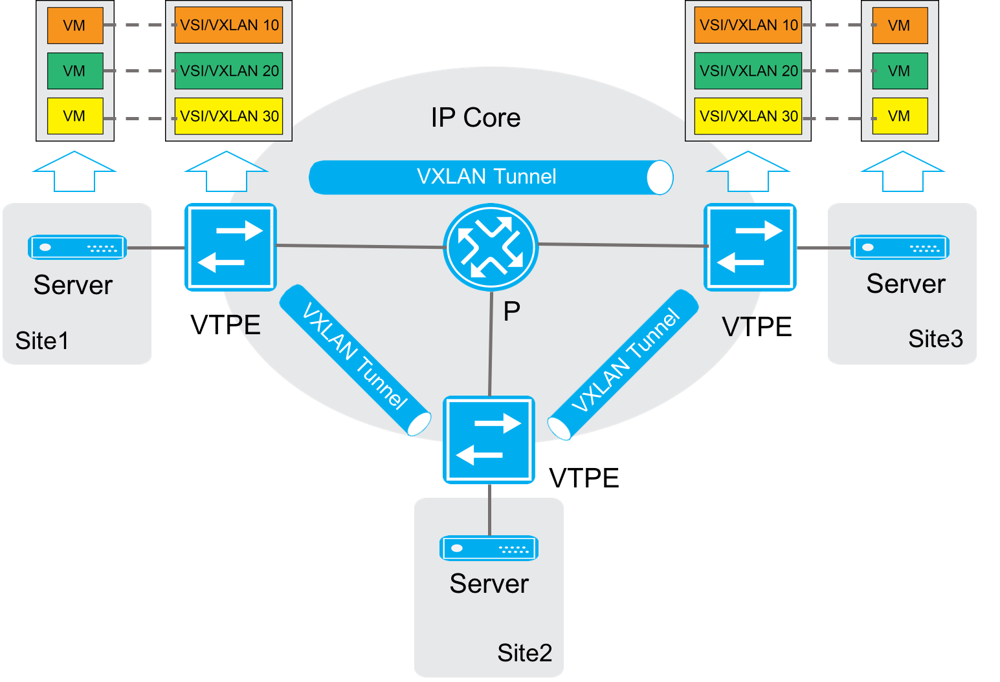
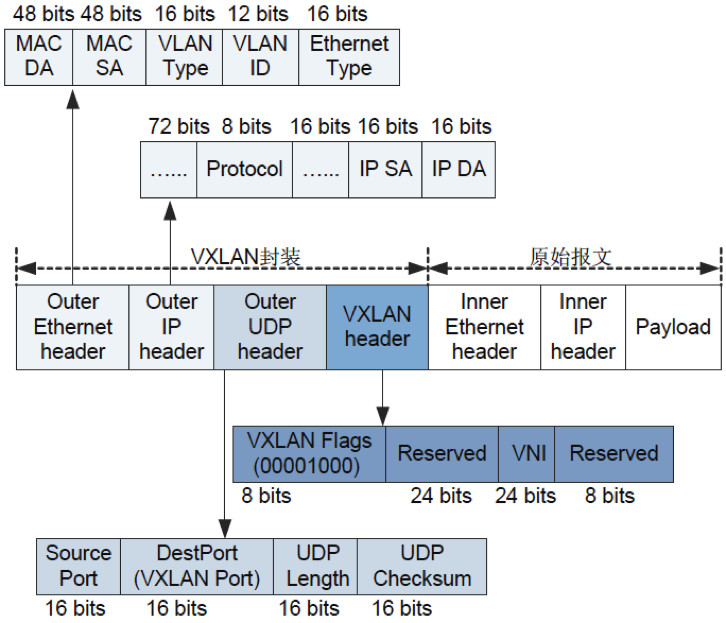
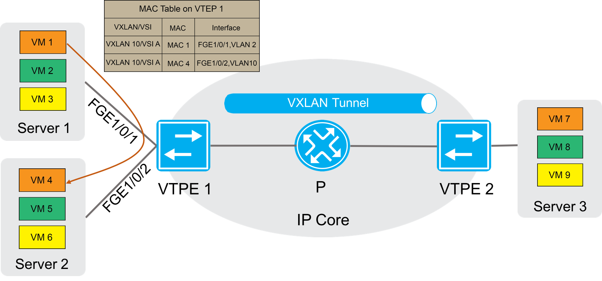
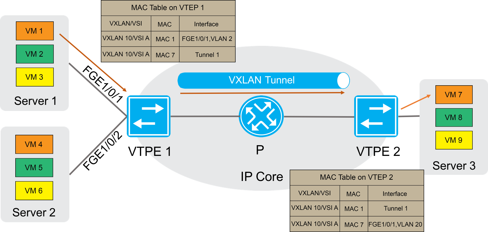

VXLAN简介
=====================================

概述
---------------------------------------

在云计算中，大量的采用和部署虚拟化是一个基本的技术模式。而服务器虚拟化技术的广泛部署，增加了数据中心的计算密度。同时为了实现业务的灵活变更，虚拟机需要在网络中不受限制的迁移。

虚拟机数量的快速增长与虚拟机迁移业务的日趋频繁，给传统的“二层+三层”数据中心网络带来了新的挑战：

 * 虚拟机规模受网络设备MAC地址表项规格的限制
 * 传统网络的VLAN隔离能力有限，
 * 在传统的二层域中，虚拟机迁移范围受限。

VXLAN（Virtual eXtensible Local Area Network）虚拟扩展本地网络，是NVO3（Network Virtulization over Layer3）中的一种网络虚拟化技术。VXLAN采用MAC in UDP的报文封装方式，将二层报文用三层协议进行封装，可实现二层网络在三层范围内进行扩展，同时满足数据中心大二层虚拟迁移和多租户的需求。

VXLAN具有如下优点：

 * 降低对MAC地址规格的需求。
   
   虚拟机发出的数据包封装在UDP，使用物理网络的IP地址、MAC地址作为外层头进行封装，对网络只表现为封装后的参数，降低了对MAC地址规格的需求。

 * 满足用户的大量隔离需求。

   VXLAN采用VNI（VXLAN Network Identifier）进行用户标识。VNI由24比特组成，支持多达16M的VXLAN段，从而满足了大量的用户标识。

 * 虚拟机迁移不受网络架构限制。

   VXLAN通过采用MAC in UDP封装来延伸二层网络，将以太报文封装在IP报文之上，通过路由在网络中传输，无需关注虚拟机的MAC地址。且路由网络无网络结构限制，通过路由网络，虚拟机迁移不受网络架构限制。

VXLAN网络模型
---------------------------------------

角色组成
+++++++++++++++++++++++++++++++++++++++
VXLAN网络模型示意图

VXLAN网络中有以下角色组成：

 * VM（Virtual Machine）虚拟机
   在一台服务器上可以创建多台虚拟机，不同的虚拟机可以属于不同的VXLAN。属于相同 VXLAN的虚拟机处于同一个逻辑二层网络，彼此之间二层互通。属于不同VXLAN的虚拟机之间二层隔离。

 * VTEP（VXLAN Tunnel Endpoints）VXLAN隧道端点
   VXLAN网络的边缘设备，是VXLAN隧道的起点和终点，VXLAN报文的相关处理均在这上面进行。VTEP既可以是一台独立的网络设备，也可以是虚拟机所在的服务器。

 * VNI（VXLAN Network Identifier）VXLAN 网络标识符
   VNI是类似于VLAN ID。一个VNI代表了一个VXLAN段，属于不同VXLAN的虚拟机之间不能直接进行二层通信。

 * VXLAN隧道
   VXLAN隧道是建立在两个VTEP之间的一条虚拟通道，用来传输经过VXLAN封装的报文。VXLAN报文中源IP地址为本节点的VTEP地址，VXLAN报文中目的IP地址为对端节点的VTEP地址，一对VTEP地址就对应着一个VXLAN隧道。

 * VSI（Virtual Switching Instance）虚拟交换实例
   VTEP上为一个VXLAN提供二层交换服务的虚拟交换实例。VSI与VXLAN一一对应，可以看作是VTEP上的一台基于VXLAN 进行二层转发的虚拟交换机, 它具有传统以太网交换机的所有功能，包括源 MAC 地址学习、MAC 地址老化、泛洪等。

报文格式
+++++++++++++++++++++++++++++++++++++++
VXLAN报文格式

外层Ethernet头封装。

 * SA：发送报文的虚拟机所属的VTEP的MAC地址。
 * DA：目的虚拟机所属VTEP上路由表中智联的下一跳MAC地址。
 * VLAN Type：可选字段，当报文中携带VLAN Tag时，该字段取值为0x8100。
 * Ethernet Type：以太报文类型，IP协议报文该字段取值为0x0800。

外层IP头封装
 
 * 源IP地址为发送报文的虚拟机所属VTEP的IP地址；目的IP地址是目的虚拟机所属的VTEP的IP地址。

外层UDP封装

 * 目的UDP端口号是4789。源端口号是内层以太报文头通过哈希算法计算后的值。

VXLAN头封装

 * Flags：8比特，取值为00001000
 * VNI：VXLAN网络标识，24比特，用于区分VXLAN段
 * Reserved：24比特和8比特，必须设置为0。

Connetos支持的VXLAN功能
=======================================
VXLAN可以为分散的物理站点提供二层互联实现VXLAN Bridging，即实现相同VXLAN中的相同网段之间的通信。当部署VXLAN Gateway时，可以为VXLAN站点内或站点间的虚拟机提供三层通信。

当前Connetos只支持VXLAN Bridging。

VXLAN运行机制
---------------------------------------
VXLAN隧道支持如下两种工作模式：

 * 二层转发模式：VTEP通过查找MAC地址表项对流量进行转发。
 * 三层转发模式：VTEP设备通过查找ARP表项对流量进行转发。

VXLAN Bridging工作在二层转发模式下，可以使相同网段的虚拟机通过VXLAN通信。当前Connetos只支持二层转发模式，VXLAN Bridging运行机制可以概括为：

 #. 识别接收到的报文所属的VXLAN，以便将报文的源MAC地址学习到VXLAN对应的VSI（虚拟交换实例），并在该VSI内转发该报文。
 #. 学习虚拟机的MAC地址。
 #. 根据报文的目的MAC地址表项转发报文。

识别报文所属的VXLAN
---------------------------------------
#. 本地站点内接收到数据帧的识别

   VTEP将连接本地站点的端口绑定匹配规则后与VSI关联。VTEP从端口接收到数据帧后，根据匹配规则查找与其关联的VSI，VSI关联的VXLAN即为该数据帧所属的VXLAN。

   在VXLAN中，与VSI关联的端口统称为AC（Attachment Circuit，接入电路）。其中，AC在二层以太网接口上创建，它定义了一系列匹配规则，用来匹配从该二层以太网接口上接收到的数据帧。

#. VXLAN隧道上接收报文的识别
    
   对于从VXLAN隧道上接收到的VXLAN报文，VTEP根据报文中携带的VXLAN ID判断该报文所属的VXLAN。

学习MAC地址
---------------------------------------
MAC地址学习分为：

 * 本地MAC地址学习

   本地MAC地址学习是指VTEP对本地站点内虚拟机MAC地址的学习。VTEP接收到本地虚拟机发送的数据帧后，判断该数据帧所属的VSI（VXLAN），并将数据帧中的源MAC地址（本地虚拟机的MAC地址）添加到该VSI的MAC地址表中，该MAC地址对应的接口为接收到数据帧的接口。

   VXLAN不支持静态配置本地MAC地址。

 * 远端MAC地址学习

   远端MAC地址学习是指VTEP对远端站点内虚拟机MAC地址的学习。远端MAC地址的学习方式有如下两种：

    * 静态配置：手工指定远端MAC地址所属的VSI（VXLAN），及其对应的VXLAN隧道接口。

    * 通过内层报文中的源MAC地址动态学习：
      VTEP从VXLAN隧道上接收到远端VTEP发送的VXLAN报文后，根据VXLAN ID判断报文所属的VXLAN，对报文进行解封装，还原二层数据帧，并将数据帧中的源MAC地址（远端虚拟机的MAC地址）添加到所属VXLAN对应VSI的MAC地址表中，该MAC地址对应的接口为VXLAN隧道接口。

   静态配置的远端MAC地址表项优先级高于源MAC地址动态学习的表项，后生成的表项可以覆盖已经存在的表项。

接入模式
---------------------------------------
接入模式分为以下两种：

 * VLAN接入模式

   从本地站点接收到的、发送给本地站点的以太网帧可以携带VLAN tag，也可以不携带VLAN tag。VTEP从本地站点接收到以太网帧后，根据报文的tag映射到相应的VNI，删除该帧的最外一层VLAN tag，再转发该数据帧。

   VTEP发送以太网帧到本地站点时，根据VNI映射出VLAN，如果该VLAN为其tagged VLAN则添加VLAN tag，否则不需要添加。采用该模式时，VTEP不会传递VLAN tag信息，不同站点可以独立地规划自己的VLAN，不同站点的不同VLAN之间可以互通。

 * Ethernet接入模式

   从本地站点接收到的、发送给本地站点的以太网帧可以携带VLAN tag，也可以不携带VLAN tag。VTEP从本地站点接收到以太网帧后，所有报文都映射到对应的VNI，删除该帧的最外一层VLAN tag，再转发该数据帧；VTEP发送以太网帧到本地站点时，不会为其添加VLAN tag。

转发已知单播流量
---------------------------------------
完成本地和远端MAC地址学习后，VTEP在VXLAN内转发已知单播流量分为:

 * 站点内转发
 * 站点间转发

站点内流量
+++++++++++++++++++++++++++++++++++++++
对于站点内流量，VTEP判断出报文所属的VSI后，根据目的MAC地址查找该VSI的MAC地址表，从相应的本地接口转发给目的VM。

站点内单播流量转发

如上图所示，以VM 1（MAC地址为MAC 1）发送以太网帧到VM 4（MAC地址为MAC 4）为例，站点内单播流量的转发过程为：

#. VM 1发送以太网数据帧给VM 4，数据帧的源MAC地址为MAC 1，目的MAC为MAC 4，VLAN tag为2。
#. VTEP 1从接口GigabitEthernet1/0/1收到该数据帧后，判断该数据帧属于VSI A（VXLAN 10），查找VSI A的MAC地址表，得到MAC 7的出端口为FortyGigE1/0/2，坐在VLAN为VLAN10。
#. VTEP 2从接口GigabitEthernet1/0/2的VLAN 10内将数据帧发送给VM 4。

站点间流量
+++++++++++++++++++++++++++++++++++++++
对于站点间流量，VTEP判断出报文所属的VSI后，根据目的MAC地址查找该VSI的MAC地址表，从相应的隧道将封装后的VXLAN报文给对端VTEP。

站点间单播流量转发

如上图所示，以VM 1（MAC地址为MAC 1）发送以太网帧给VM 7（MAC地址为MAC 7）为例，站点间单播流量的转发过程为：

#. VM 1发送以太网数据帧给VM 7，数据帧的源MAC地址为MAC 1，目的MAC为MAC 7，VLAN tag为2。
#. VTEP 1从接口GigabitEthernet1/0/1收到该数据帧后，判断该数据帧属于VSI A（VXLAN 10），查找VSI A的MAC地址表，得到MAC 7的出端口为Tunnel 1。
#. VTEP 1为数据帧封装VXLAN头、UDP头和IP头后，将封装好的报文通过VXLAN隧道Tunnel 1、经由IP设备发送给VTEP 2。
#. VTEP 2接收到报文后，根据报文中的VXLAN ID判断该报文属于VXLAN 10，并剥离VXLAN头、UDP头和IP头，还原出原始的数据帧。
#. VTEP 2查找与VXLAN 10对应的VSI A的MAC地址表，得到MAC 7的出端口为GigabitEthernet1/0/1，所在VLAN为VLAN 20。
#. VTEP 2从接口GigabitEthernet1/0/1的VLAN 20内将数据帧发送给VM 7。

BUM流量
---------------------------------------
BUM流量包括组播、广播和未知单播流量。

根据复制方式的不同，流量泛洪方式分为:

 * 单播路由方式（头端复制）
 * 组播路由方式（核心复制）

转发BUM流量
+++++++++++++++++++++++++++++++++++++++
单播路由的方式又称为头端复制。接口收到BUM报文后，本地VTEP通过控制平面获取属于同一个VNI的VTEP列表，将收到的BUM报文通过本地接口发送给本地站点，根据VTEP列表进行复制并发送给属于同一个VNI的所有VTEP。通过头端复制完成BUM报文的泛洪，不需要依赖组播路由协议。 

头端复制方式转发示意图

.. iamge:: vxlan_header_duplicate.png

如上图所示，头端复制方式的BUM流量转发过程为：

#. VTEP 1接收到本地虚拟机发送的组播、广播和未知单播数据帧后，判断数据帧所属的VXLAN，通过该VXLAN内除接收接口外的所有本地接口和VXLAN隧道转发该数据帧。通过VXLAN隧道转发数据帧时，需要为其封装VXLAN头、UDP头和IP头，将BUM数据帧封装在多个单播报文中，发送到VXLAN内的所有远端VTEP。

#. 远端VTEP（VTEP 2和VTEP 3）接收到VXLAN报文后，解封装报文，将原始的数据帧在本地站点的指定VXLAN内泛洪。为了避免环路，远端VTEP从VXLAN隧道上接收到报文后，不会再将其泛洪到其他的VXLAN隧道。

BUM流量抑制
+++++++++++++++++++++++++++++++++++++++
缺省情况下，VTEP从本地站点内接收到BUM数据帧后，会在该VXLAN内除接收接口外的所有本地接口和VXLAN隧道上泛洪该数据帧，将该数据帧发送给VXLAN内的所有站点。如果用户希望把该类数据帧限制在本地站点内，不通过VXLAN隧道将其转发到远端站点，则可以通过配置命令手工禁止VXLAN对应VSI的泛洪功能。

负载均衡
+++++++++++++++++++++++++++++++++++++++
Connetos交换机作为VTEP封装VXLAN时，如果tunnel的路由有多个下一跳或出接口是LAG口，封装后的VXLAN报文负载均衡发送出去。
Connetos交换机作为中间设备，三层转发VXLAN报文时，可以配置指定外层或内层原始报文做Hash后负载均衡。

配置VXLAN
=======================================

配置VSI
---------------------------------------
#. 进入配置模式。

   ConnetOS> **configure**

#. 创建VSI。

   ConnetOS# **set vsi vsi-id** *vsi-id*

#. （可选）配置VSI描述。

   ConnetOS# **set vsi vsi-id** *vsi-id* **description** *description*

#. 将VSI和VNI关联。

   ConnetOS# **set vsi vsi-id** *vsi-id* **vni** *vni-id*

#. 关联VXLAN隧道与VSI。

   ConnetOS# **set vsi vsi-id** *vsi-id* **tunnel-ethernet** *tunnel-name*

#. 配置BUM流量抑制

   ConnetOS# **set vsi vsi-id** *vsi-id* **flooding enable** { **false** | **true** }

#. 提交配置。

   ConnetOS# **commit**

配置VXLAN隧道
---------------------------------------
#. 创建隧道。

   ConnetOS# **set interface tunnel-ethernet** *tunnel-name*

#. 配置隧道模式为VXLAN。

   ConnetOS# **set interface tunnel-ethernet** *tunnel-name* **mode vxlan**

#. 配置VXLAN隧道源端IP地址。
   
   ConnetOS# **set interface tunnel-ethernet** *tunnel-name* **source address** *ip-address*

#. 配置VXLAN隧道目的端IP地址。

   ConnetOS# **set interface tunnel-ethernet** *tunnel-name* **destination address** *ip-address*

#. （可选）配置VXLAN隧道描述。
 
   **set interface tunnel-ethernet** *tunnel-name* **description** *description*

#. 配置静态远端MAC地址。

   ConnetOS# **set interface tunnel-ethernet** *tunnel-name* **static-mac-address** *mac-address* [ **vsi** *vsi-id* ]

#. 提交配置。

   ConnetOS# **commit**

配置VXLAN业务接入点
---------------------------------------
#. 配置VXLAN业务接入点。

   ConnetOS# **set interface** { **gigabit-ethernet** | **aggregate-ethernet** } *interface-name* **family ethernet-switching vsi** *vsi-id* { **ethernet-mode enable true** | **vlan-mode dot1q** *vlan-id* }

#. 提交配置。

   ConnetOS# **commit**
