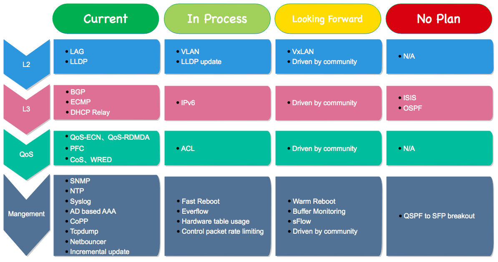

SONiC
=======================================

简介
---------------------------------------
SONiC（Software for Open Networking in the Cloud）是微软开源的一套，据称能应用于云数据中心环境下的交换机三层软件功能组件集，该软件缺省运行在Debian GNU/Linux 8上。

功能介绍
---------------------------------------

基本功能
+++++++++++++++++++++++++++++++++++++++
SONiC原本服务于微软数据中心网络，它实现的是微软数据中心里所需要使用到的一些功能。微软将SONiC开源出来后，虽然后续有计划再增加一些新的特性，但是从功能的完备性来讲，可覆盖的场景比较有限。虽然微软号称在云数据中心场景下得到了使用，但这并不能代表能示范性地被毫无代价平移到其他用户，微软能够成功驾驭很大程度上受益于微软网络架构方面的精简和强大控制能力。

下面我们来看看SONiC开源出来的特性，以及未来计划再增加的特性，甚至一些微软明确表示不会支持的特性。

亮点
+++++++++++++++++++++++++++++++++++++++
微软的数据中心网络遍布全球，规模首屈一指，在数据中心网络的运营和管理上微软积累了丰富的经验。比如广为大家所熟悉的pingmesh、everflow、netbouncer等用于分析诊断方面的功能。

而微软开源SONiC的同时，将自己在数据中心网络运营实践方面的经验也一并开放给了外界，everflow、netbouncer等功能就是SONiC软件里要支持的功能。这些功能的开放，是广大网络运维工程师的福音，让网络排障再也不仅仅只是依靠ping、traceroute或者纯人工经验，而是走向智能化和科学化。

应用：SONiC和云数据中心
---------------------------------------
从目前云数据中心主流架构来看，为了提升可靠性，大部分的用户都选择了MLAG或堆叠的技术方案。MLAG或堆叠功能几乎成为云环境下网络架构的标配功能。

SONiC的Roadmap里并没有体现出对这方面的功能进行支持的计划，如果想依靠社区的力量补充该功能的话，风险和稳定性等都是需要谨慎考虑的问题。

也就是说，SONiC虽然提供了交换机的一些主要业务功能，但是目前对于绝大多数主流的云数据中心环境而言，是无法胜任的。

常见问题
---------------------------------------

SONiC是全开源的么？
+++++++++++++++++++++++++++++++++++++++
答：SONiC不是全开源的，交换芯片适配部分，仅提供二进制格式。这主要受限于芯片厂商的License保护，微软也不能直接开源。

SONiC有统一的命令行入口么？
+++++++++++++++++++++++++++++++++++++++
答：SONiC有命令行，但伴随模块的功能分散存在，没有统一的入口，并且有些模块的命令行缺少交互界面。 

SONiC支持API接口么？
+++++++++++++++++++++++++++++++++++++++
答：暂不支持。

SONiC支持堆叠或MLAG么？
+++++++++++++++++++++++++++++++++++++++
答：暂不支持。

SONiC支持Openflow么？
+++++++++++++++++++++++++++++++++++++++
答：暂不支持。

SONiC适合什么样的用户？
+++++++++++++++++++++++++++++++++++++++
答：具备较强的交换机软件研发能力，并且数据中心网络架构为三层架构且功能要求相对比较简单，满足这些条件的用户可以尝试直接使用SONiC。

更多SONiC问题，请扫码探讨：

