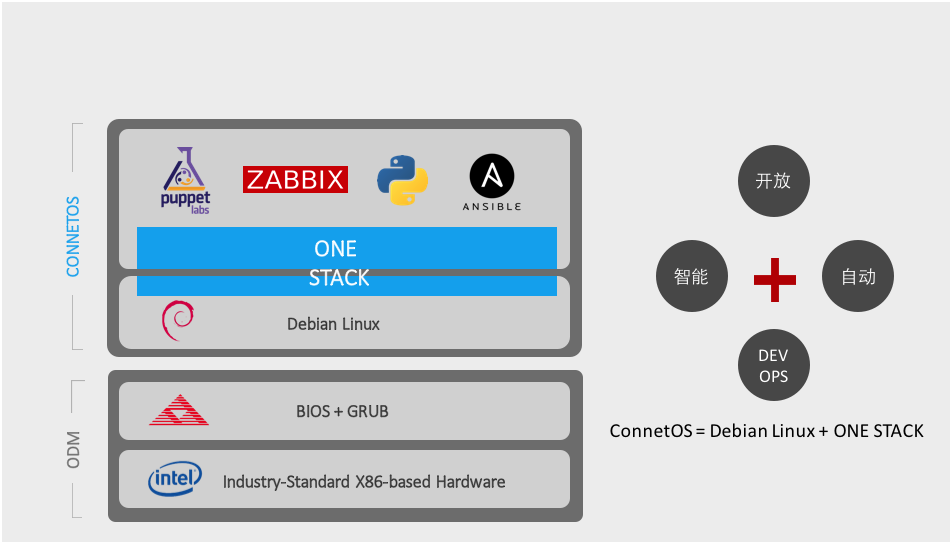

认识ConnetOS
=======================================

ConnetOS简介
---------------------------------------
ConnetOS系统（以下简称为ConnetOS）是云启科技开发的一款基于Debian GNU/Linux的开放交换机操作系统，适用于现代数据中心网络环境。

ConnetOS以数据中心网络的运维痛点和运营效率出发，前所未有地开放网络资源和自身能力，提供以数据中心网络自动化和智能化为目标的一系列功能，着眼于消除数据中心网络运维痛点，让网络不仅开放而且易运维。

用户可以二次开发或完全编写自己的代码、部署第三方软件，甚至可以基于交换机OS提供的资源化、服务化能力进行交换机转发逻辑的控制。

针对开放式网络而生
+++++++++++++++++++++++++++++++++++++++
ConnetOS是基于开放网络理念构建的一个交换机操作系统，适用于现代数据中心网络架构。ConnetOS的Linux系统完全面向用户开放，让用户体验到“A Switch as A Server”，享受标准Linux发行版带来的便利性以及良好的软件生态。

ConnetOS具有以下特点：

* ConnetOS系统完全开放给用户，提供用户在Linux系统上直接访问的能力。

* 天然的DEVOPS能力，支持灵活的二次开发和定制开发。

* 支持丰富的远程控制设备的方式和apt-get/dpkg软件包管理方式

为软件定义网络做好准备
+++++++++++++++++++++++++++++++++++++++

* 基于白盒的操作系统，能够在运行在不同的设备厂商上，带来全新级别的自由度和灵活性。
* 支持丰富的二三层功能和流量策略。
* 第三方操作系统支持能够轻松切入到SDN。

全方位关注网络运维
+++++++++++++++++++++++++++++++++++++++
* 关注网络运维痛点
  
   * 监听和分析转发平面所有数据包，包括丢弃和转发：sFlow、sDrop、Mirror
   * 实时捕获被设备丢弃的数据包，并记录丢包原因：Tcpdump
   * 根据五元组实时计算网络转发路径：Navmesh
   * 具备端口拥塞感知和实时上报能力：sDrop
   * 高精度端口统计：秒级统计。

* 关注网络运营效率
  
   * 网络部署效率：自主研发的全自动部署功能，提供高效零配置上线解决方案。
   * 网络监控效率：全方位的监控体系Streaming Telemetry（sFlow、sDrop、sMetric），让数据统计和导出更精准高效。
   * 软件升级效率：Warmboot的升级方式，保证数据中心网络设备的快速迭代升级。

* 关注设备健康状态

   * 建立自主研发的健康评估管理体系，针对设备的几十项操作指标，实时进行信息搜集和分析。
   * 支持两种方式查看健康状态：设备上查看，订阅的方式远程导出。

ConnetOS使用
---------------------------------------
ConnetOS提供两个shell视图：

 * Linux shell：Linux界面视图，用户初始登录的视图，亦即Debian Linux系统的缺省shell环境。
 * CLI shell：命令行接口（Command-line Interface）视图，用于对交换机的网络操作和管理。

用户登录到设备后，输入账户和密码，进入到Linux shell，输入cli，即可进入CLI shell。

Linux shell
+++++++++++++++++++++++++++++++++++++++

CLI shell
+++++++++++++++++++++++++++++++++++++++

ConnetOS的管理
---------------------------------------
介绍可以connetos如何进行管理

ConnetOS应用
---------------------------------------
可以安装应用在什么硬件上

