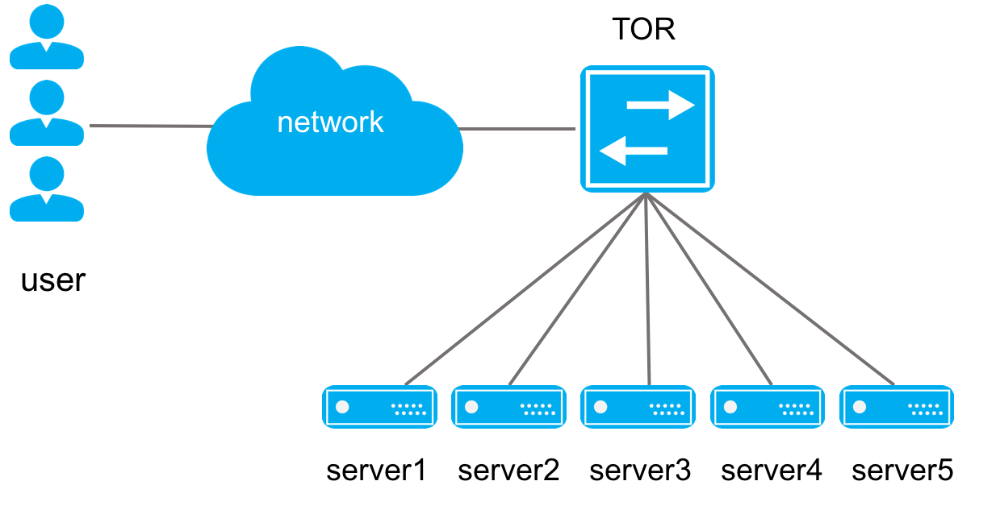

CDN负载均衡
=======================================

网络需求
---------------------------------------
CDN（Content Delivery Network）内容分发网络，目的是通过在现有的Internet中增加一层新的网络架构，将网站的内容发布到最接近用户的网络"边缘"，使用户可以就近取得所需的内容，解决Internet网络拥塞状况，提高用户访问网站的响应速度。

实现CDN的关键技术是服务器负载均衡，一般通过专用的硬件负载均衡器或软件负载均衡器实现。但是硬件负载均衡器价格高昂，而软件负载均衡性能差。

技术优势
---------------------------------------
ConnetOS支持的一致性Hash的负载均衡，在CDN场景下，不但可以作为缓存服务器的大密度高带宽的接入TOR，同时还可以作为高性能的负载均衡器。相较于专用的硬件和软件的负载均衡器，采用TOR实现负载均衡可以降低成本、提高性能、提高稳定性、简化网络拓扑及减小运维难度等优势。

实现方案
---------------------------------------
实现TOR对多台服务器负载均衡方案的核心在于TOR上建立到服务器VIP的ECMP路由，通过配置TOR和服务器即可实现。有两种配置方案：

 * 静态路由配置
 * OSPF动态路由配置

静态路由和OSPF动态路由两种配置方案的比较如下所示：
=======   ==========================    =============================================
比较       静态路由配置                    OSPF动态路由
=======   ==========================    =============================================
优点	      易于配置无需安装Quagge           扩展服务器时不需要配置TOR，仅配服务器即可
缺点	      扩展服务器时需要配置TOR          需要熟悉OSPF及Quagga的使用，学习和运维成本高
=======   ==========================    =============================================

从表中可以看出两种方案各有优缺点，需要根据实际的应用场景比如网络的规模做权衡而采用适合的方案。