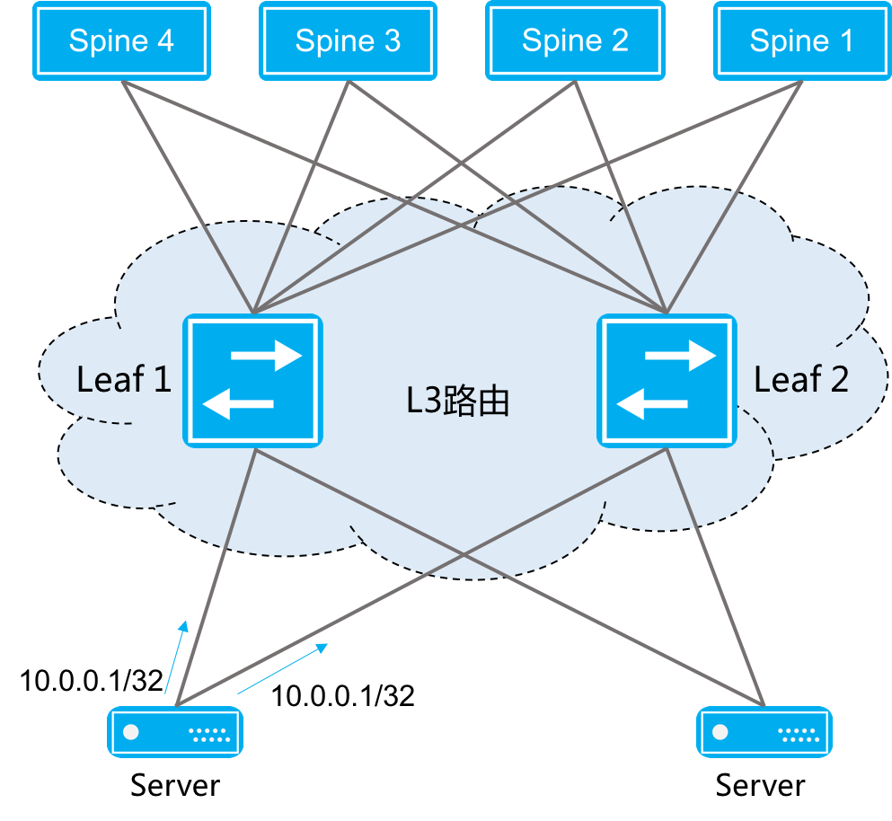

高可靠网络
=======================================

网络需求
---------------------------------------
云计算的发展，对网络的稳定性提出了更高的要求。ConnetOS操作系统提供多种解决方案，以应对云计算用户对基础网络稳定性的需求。

技术优势
---------------------------------------

传统堆叠网络方案
+++++++++++++++++++++++++++++++++++++++

现代数据中心网络方案
+++++++++++++++++++++++++++++++++++++++

方案对比
+++++++++++++++++++++++++++++++++++++++

=======   ============================   =================================
对比       传统堆叠方案                   现代数据中心网络方案
=======   ============================   =================================
维护       管理方便，维护简单              网络架构一致性好，配置相对复杂
稳定性     稳定性差，升级难度高            扩展性强，稳定性高
兼容性     跨厂商不兼容，问题定位困难       跨厂商兼容性好
=======   ============================   =================================

