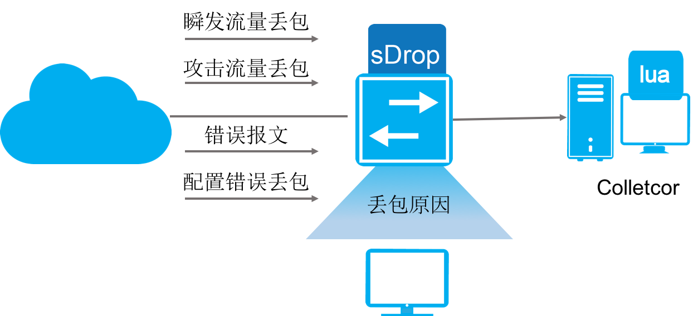

网络质量感知解决方案
=======================================

网络需求
---------------------------------------
现代网络中，出现的网络问题大多和丢包有关，如何进行有效的丢包诊断，一直是一个难题。

为了解决这个问题，ConnetOS对网络环境中的丢包进行了详细的分析，设计了sDrop（Streaming Dropped packet）功能。

sDrop能够：

 * 发现瞬间突发流量丢包。
 * 协助解决业务配置错误丢包。
 * 发现网络中存在攻击流量丢包。
 * 发现网络中存在的错误的报文。
 
并且提供用户全网的丢包信息的收集及分析能力。
 

技术优势
---------------------------------------
sDrop配置简单，展示结果清晰，能够帮用户快速定位丢包原因。

配置简单
+++++++++++++++++++++++++++++++++++++++
ConnetOS通过分析数据中心存在的20多种常见丢包，将报文分成两类处理。

 * 可以获取丢弃的原始报文，将报文送往cpu进行分析，得到丢包原因。
 * 无法获取丢弃的原始报文，通过获取统计信息，得到丢包的原因。

sDrop缺省情况下是使能的，用户只需要指定Collector即可。

展示方便
+++++++++++++++++++++++++++++++++++++++
对于丢包的感知我们提供了两种的展示方式：设备上和设备外。

设备上
^^^^^^^^^^^^^^^^^^^^^^^^^^^^^^^^^^^^^^^
设备上我们提供了命令行，查看基本信息，可以定位基本的丢包原因::

 Info of Dropped Packets in last x min.
 Input Physical Port     Out Physical Port       Drop Reason                         Last Detectted time
 --------------------    -----------------       ---------------------------         -------------------
 te-1/1/1                NA                      Tag Vlan not exist                  2001-11-23 11:22:23
 te-1/1/1                NA                      Port not in Tag Vlan Member         2001-11-23 11:22:23
 te-1/1/1                NA                      Ingress MTU check fail              2001-11-23 11:22:23
 te-1/1/1                te-1/1/2                Egress MTU check fail               2001-11-23 11:22:23

同时还提供了丢包的报文详细信息的查看，以分析实际的根本丢包原因::

 Detail of Dropped packet in last x min.
 Dropped packet detial entry 1:
     Meta Data:
         Ingress Physical Port: te-1/1/6      Egress Physical Port: NA
         Drop Reason: L3 Lookup Miss
         Last Detectted Time: 2001-11-23 11:22:33
     Packet Data:
         Dmac: 00:11:11:22:22:22  Smac: 00:22:22:33:33:33  Ethertype: 0x800  Length:153
         Ip Version: Ipv4    Tos: 12     Ip Length: 135  TTL: 32     Protocol:6
         Source Ip: 52.52.52.52    Dest Ip: 12.12.12.12
         L4 Source Port: 2048     L4 Dest Port: 1024

设备外
^^^^^^^^^^^^^^^^^^^^^^^^^^^^^^^^^^^^^^^
设备支持将报文的丢包信息导出，通过wireshark的lua插件进行展示，展示的结果如下所示。

