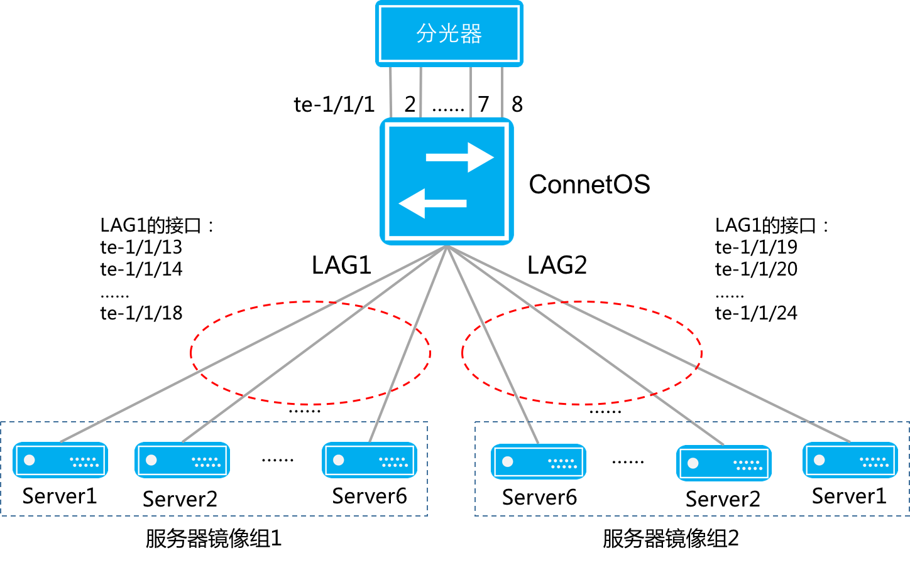

分流器解决方案
=======================================

网络需求
---------------------------------------
在数据中心网络场景下，需要采用TAP（Test Access Point）方式监视所有数据中心的网络流量，要求分光器的流量进入指定端口。TAP流量镜像到两组服务器，每组服务器都得到完整的分光流量。

同时要求：

#. 分光器进入的流量不带VLAN Tag。
#. 服务器组内的流量进行负载分担，流量均匀并且同源同宿。

ConnetOS提供的负载均衡和对称哈希特性，可以支持数据中心网络场景下的TAP（Test Access Point）分流应用。

技术优势
---------------------------------------

配置思路简单
+++++++++++++++++++++++++++++++++++++++
#. 首先将两组服务器组分别进行汇聚，然后将两个汇聚组和多个入口全部划入一个VLAN。 
#. 利用广播特性让每个汇聚组都得到一份相同的流量。
#. 在入端口关闭MAC地址学习功能。
  
   考虑到流量镜像场景下多个入口进入的报文可能存在源目的MAC地址颠倒情况。为了避免交换机MAC地址学习后这 类报文无法转发，因此需要在入端口关闭MAC地址学习功能。

#. 为了确保同源同宿，使能LAG的对称哈希。

配置举例
+++++++++++++++++++++++++++++++++++++++
举例如下::

 ConnetOS> configure
 ConnetOS# set vlans vlan-id 100
 ConnetOS# set interface gigabit-ethernet te-1/1/13:18 ether-options 802.3ad ae1
 ConnetOS# set interface gigabit-ethernet te-1/1/19:24 ether-options 802.3ad ae2
 ConnetOS# set interface aggregate-ethernet ae1 family ethernet-switching native-vlan-id 100
 ConnetOS# set interface aggregate-ethernet ae2 family ethernet-switching native-vlan-id 100
 ConnetOS# set interface gigabit-ethernet te-1/1/1:8 family ethernet-switching native-vlan-id 100
 ConnetOS# set interface gigabit-ethernet te-1/1/1:8 ether-options mac-learning enable false
 ConnetOS# set forwarding-options load-balance lag symmetric enable true
 ConnetOS# commit

