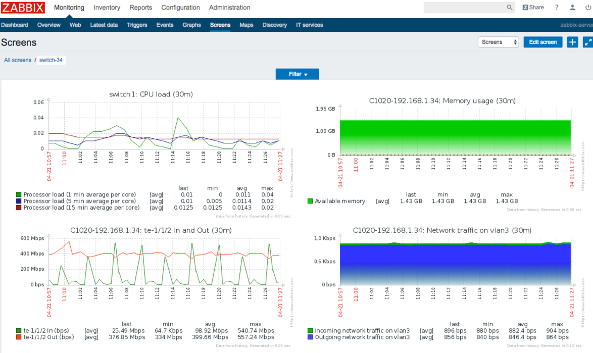

网络可视化
=======================================

网络需求
---------------------------------------
在运维中，网络专家需要从大量的数据中，寻找异常数据或探测出网络趋势。网络可视化以生动形式呈现隐藏的庞大数据，有效帮助用户做业务的数据洞察

技术优势
---------------------------------------
Zabbix是一个企业级的、开源的、分布式的监控套件。可以实时监控交换机的系统、网络和服务状况。在ZabbixServer上导入ConnetOS的Zabbix监控模板后便可以支持网络的可视化监控。

ConnetOS能够提供给用户生动、形象的监控效果。

实现方案
---------------------------------------

导入监控模板
+++++++++++++++++++++++++++++++++++++++

通过Web浏览器登录Zabbix的控制平台，进入导入模板的界面，Configuration->Templates->Import。

选中本地的模板文件ConnetOS_Zabbix_Template.xml，点击Import。

设置SNMP Community宏，Administration->General->Macros 此处的配置要与交换机中的community保持一样。

导入ConnetOS模板
+++++++++++++++++++++++++++++++++++++++
Zabbix需要外部shell脚本实现对交换机内存的监控，登录安装Zabbix Server的服务器，进入Zabbix执行外部脚本的目录/usr/lib/zabbix/externalscripts，该目录可以通过Zabbix Server的配置文件zabbix_server.conf找到。

将附件中的ConnetOS_Zabbix_Script.sh复制到usr/lib/zabbix/externalscripts/中，并更改权限为777::

 $ sudo cp ConnetOS_Zabbix_Script.sh /usr/lib/zabbix/externalscripts/
 $ sudo chmod 777 /usr/lib/zabbix/externalscripts/ConnetOS_Zabbix_Script.sh

创建Hosts
+++++++++++++++++++++++++++++++++++++++
打开创建主机界面，Configuration->Hosts->Create host。

#. Host name 主机名称，最好与交换机名称一致，可再带上交换机的IP。

#. Group 选择交换机所属的群组Switch。

#. Agent interfaces 填写交换机的IP。

#. SNMP interfaces 填写交换机的IP。

#. 选择Host选择旁边的Templates选项为主机选择所属的模板。

#. 点击Select进入到模板选择界面。

#. Group 这里选择之前建立的Switch Templates。

#. 选择主机所属的模板，点击Select返回Host的Templates界面。

#. 再次执行第6步的操作添加Linux模板，这次选择Templates的Group。选择Template OS Linux的模板之后点击Select。

#. 点击Add，确定增加这个模板给到这个Host，这一步很重要。

#. 确定Linked templates里面有我们刚才选择的模板之后，点击Add，创建完成。

创建完成后主机会自动建立模板中创建好的Item。Availablity这一栏中的SNMP是绿色的，表示通过SNMP监控成功，不成功则为红色。

配置ConnetOS
+++++++++++++++++++++++++++++++++++++++
进入ConnetOS CLI之后做如下配置::

 ConnetOS>
 ConnetOS> configure
 ConnetOS# set protocols snmp community public
 ConnetOS# commit

